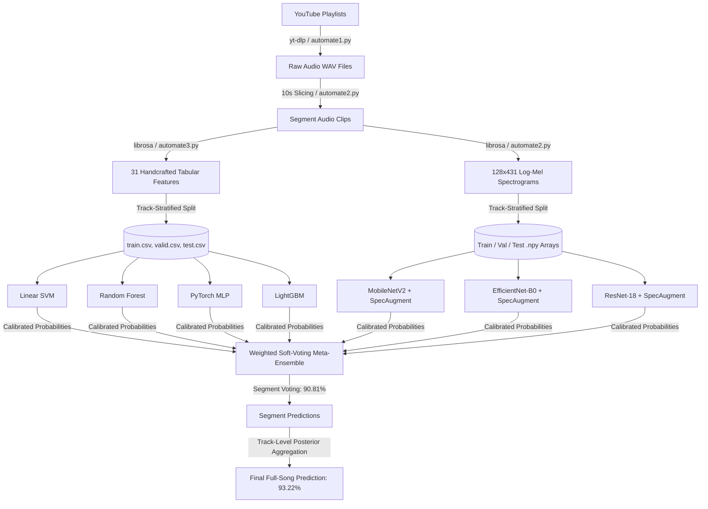

# Multi-Modal Song Genre Classification

[](https://www.python.org/)
[](https://pytorch.org/)
[](https://librosa.org/)
[](https://scikit-learn.org/)
[](https://lightgbm.readthedocs.io/)

An end-to-end multi-modal deep learning and machine learning system for music genre classification. This framework ingests raw YouTube audio, extracts 31 handcrafted acoustic features as well as 128-band Log-Mel Spectrogram matrices, and leverages an ensemble of deep convolutional networks and tabular classifiers with full-track aggregation to achieve **93.22% full-song accuracy** across 9 distinct music genres.

---

## Table of Contents

- [Highlights &amp; Key Results](#highlights--key-results)
- [Pipeline Architecture](#pipeline-architecture)
- [Dataset &amp; Data Leakage Prevention](#dataset--data-leakage-prevention)
- [Feature Engineering](#feature-engineering)
- [Model Architectures](#model-architectures)
  - [Tabular Feature Models](#1-tabular-feature-models-31-features)
  - [Deep CNN Spectrogram Models](#2-deep-cnn-spectrogram-models-128x431-log-mel)
  - [Multi-Modal Ensemble &amp; Song Aggregation](#3-multi-modal-ensemble--song-aggregation)
- [Benchmark Results](#benchmark-results)
- [Repository Structure](#repository-structure)
- [Installation &amp; Setup](#installation--setup)
- [Execution &amp; Usage Guide](#execution--usage-guide)
  - [1. Running Tabular Models](#1-train-tabular-models)
  - [2. Retraining &amp; Evaluating Spectrogram CNNs](#2-train--evaluate-spectrogram-cnns)
  - [3. Running the Multi-Modal Ensemble](#3-run-multi-modal-ensemble)
- [Per-Class Performance](#per-class-performance)

---

## Highlights & Key Results

- **9 Target Music Genres**: `country`, `edm`, `hiphop`, `jazz`, `kpop`, `lofi`, `pop`, `r&b`, `rock`.
- **Zero Data Leakage**: Track-level stratified splitting ensures audio segments from the same song never cross train, validation, or test sets.
- **Multi-Modal Representation**: Integrates both 1D engineered acoustic descriptors (timbral, spectral, amplitude-entropy) and 2D Log-Mel visual energy distributions.
- **Top Single Model**: Fine-tuned **ResNet-18** achieves **89.44%** segment-level accuracy and **92.09%** full-song accuracy.
- **Multi-Modal Ensemble**: Fusing 7 distinct models with segment-level soft voting achieves **90.81%** accuracy, which jumps to **93.22%** when aggregated across entire tracks.

---

## Pipeline Architecture



---

## Dataset & Data Leakage Prevention

- **Total Dataset Size**: 16,261 audio segments (10 seconds each, sampled at 22,050 Hz 16-bit mono).
- **Track-Level Stratified Splitting**:
  - Standard random segment splits cause severe data leakage because segments from the same track share identical timbral and production signatures.
  - This project enforces a strict **track-level split** via `split_features.py`:
    - **Train Set (75%)**: 12,208 segments
    - **Validation Set (15%)**: 2,442 segments
    - **Test Set (10%)**: 1,610 segments

---

## Feature Engineering

The project extracts two complementary representations:

### 1. Handcrafted Acoustic Features (31 Dimensions)

Extracted with `librosa` and custom NumPy implementations in `automate3.py`:

- **Time-Domain & Amplitude Statistics (9 features)**: Zero Crossing Rate, RMS Energy, Amplitude Envelope Mean, Energy Entropy, Mean, Variance, Skewness, Kurtosis, and Peak-to-Peak Amplitude.
- **Spectral Features (9 features)**: Spectral Centroid, Bandwidth, Contrast, Rolloff (85%), Flatness, Onset Flux, Skewness, Kurtosis, and Spectral Slope.
- **Cepstral Coefficients (13 features)**: MFCCs 1 through 13 (averaged across time frames).

Detailed mathematical formulations and feature descriptions can be found in [`features.txt`](file:///features.txt).

### 2. Log-Mel Spectrograms

- **Window Length (N_FFT)**: 2,048 samples (~92.9 ms)
- **Hop Length**: 512 samples (~23.2 ms)
- **Mel Filterbanks**: 128 frequency bands (0 Hz - 8,000 Hz)
- **Output Matrix**: `128 x 431` float32 numpy arrays normalized and stored per segment.

---

## Model Architectures

### 1. Tabular Feature Models (31 Features)

- **Linear SVM**: Median imputation, `StandardScaler`, and `CalibratedClassifierCV` for reliable probability outputs.
- **Random Forest**: 300 estimators with balanced class weights to address genre imbalances.
- **PyTorch MLP**: Deep Feedforward Network with Batch Normalization, Dropout (0.3), and `ReduceLROnPlateau` scheduler.
- **LightGBM**: Highly optimized gradient-boosted decision trees with multiclass cross-entropy and early stopping.

### 2. Deep CNN Spectrogram Models (128x431 Log-Mel)

- **ResNet-18**: ImageNet pre-trained weights, customized initial 1-channel projection layer, fine-tuned Stage 4 residual blocks, and SpecAugment (Time & Frequency masking) + Mixup.
- **EfficientNet-B0**: Pre-trained compound-scaled CNN with top MBConv block fine-tuning, AdamW optimizer, and Cosine Annealing learning rate schedule.
- **MobileNetV2**: Lightweight inverted residual bottleneck network optimized for fast inference.

### 3. Multi-Modal Ensemble & Song Aggregation

- **Weighted Soft Voting**: Probability outputs from all 7 models are dynamically weighted according to validation performance:

  - `ResNet-18`: **35.0%**
  - `EfficientNet-B0`: **30.0%**
  - `MobileNetV2`: **15.0%**
  - `PyTorch MLP`: **8.0%**
  - `Linear SVM`: **6.0%**
  - `LightGBM`: **4.0%**
  - `Random Forest`: **2.0%**
- **Track-Level Aggregation**: Song-level predictions are generated by averaging predicted segment probability vectors across all segments belonging to the same song ID.

---

## Benchmark Results

Evaluated on the official un-leaked test set (1,610 segments / 177 distinct songs):

| Model                                     | Input Representation                | Segment Accuracy | Full-Song (Track) Accuracy |
| :---------------------------------------- | :---------------------------------- | :--------------: | :------------------------: |
| **Random Forest**                   | 31 Handcrafted Features             |      47.45%      |           62.15%           |
| **LightGBM**                        | 31 Handcrafted Features             |      50.99%      |           63.28%           |
| **Linear SVM**                      | 31 Handcrafted Features             |      51.93%      |           64.97%           |
| **PyTorch MLP**                     | 31 Handcrafted Features             |      54.22%      |           66.67%           |
| **MobileNetV2**                     | 128-band Mel Spectrogram            |      77.64%      |           89.27%           |
| **EfficientNet-B0**                 | 128-band Mel Spectrogram            |      88.32%      |      **93.79%**      |
| **ResNet-18**                       | 128-band Mel Spectrogram            | **89.44%** |           92.09%           |
| **Multi-Modal Ensemble (7 Models)** | **Tabular + Mel Spectrogram** | **90.81%** |      **93.22%**      |

---

## Repository Structure

```text
Song-Genre/
├── automate1.py               # Audio downloader via yt-dlp & WAV converter
├── automate2.py               # Audio slicer (10s segments) & mel array extractor
├── automate3.py               # 31 acoustic feature extractor (writes to CSV)
├── extractlinks.py            # YouTube playlist crawler
├── split_features.py          # Track-level stratified train/val/test splitter
├── features.txt               # Complete technical feature specification
├── requirements.txt           # Pinned environment dependencies
│
├── csvs/                      # Dataset splits (track-level stratified)
│   ├── features.csv           # Full 31-feature dataset (16,261 rows)
│   ├── train.csv              # Training set (12,208 rows)
│   ├── valid.csv              # Validation set (2,442 rows)
│   └── test.csv               # Test set (1,610 rows)
│
├── models/
│   ├── ensemble.py            # Multi-model soft-voting & song aggregation script
│   ├── ensemble.ipynb         # Interactive ensemble analysis notebook
│   │
│   ├── features/              # Tabular modeling
│   │   ├── linearsvm.ipynb    # Linear SVM notebook
│   │   ├── randomforest.ipynb # Random Forest notebook
│   │   ├── mlp.ipynb          # PyTorch MLP notebook
│   │   └── retrain_tabular.py # Standalone training script for tabular models
│   │
│   └── mels/                  # Spectrogram CNN modeling
│       ├── resnet18.ipynb     # ResNet-18 training notebook
│       ├── efficientnet.ipynb # EfficientNet-B0 notebook
│       ├── mobilenetv2.ipynb  # MobileNetV2 notebook
│       ├── retrain_mels.py    # Standalone CNN retraining script with SpecAugment
│       └── test_eval.py       # Independent test evaluation and probability exporter
│
└── song_links/                # Source playlist links for all 9 genres (.csv)
```

---

## Installation & Setup

### 1. Clone the Repository

```bash
git clone https://github.com/DhruvaSingh12/Song-Genre.git
cd Song-Genre
```

### 2. Create and Activate a Virtual Environment

```bash
# Windows (PowerShell)
python -m venv .venv
.venv\Scripts\Activate.ps1

# Linux / macOS
python3 -m venv .venv
source .venv/bin/activate
```

### 3. Install Dependencies

```bash
pip install -r requirements.txt
```

---

## Execution & Usage Guide

### 1. Train Tabular Models

To train the SVM, Random Forest, PyTorch MLP, and LightGBM models on the extracted 31 acoustic features:

```bash
python models/features/retrain_tabular.py
```

This trains all models on `csvs/train.csv`, tunes on `csvs/valid.csv`, saves the model artifacts, and exports out-of-fold and test prediction probabilities.

### 2. Train & Evaluate Spectrogram CNNs

To retrain the 2D Mel Spectrogram deep architectures (ResNet-18, EfficientNet-B0, MobileNetV2) using SpecAugment:

```bash
python models/mels/retrain_mels.py
```

To evaluate the trained checkpoints and export test probability matrices:

```bash
python models/mels/test_eval.py
```

### 3. Run Multi-Modal Ensemble

To execute weighted soft voting and calculate segment and track-level accuracies:

```bash
python models/ensemble.py
```

---

## Per-Class Performance

Classification breakdown on the test set for the Multi-Modal Ensemble:

```text
              Precision    Recall  F1-Score   Support
     Country       0.85      0.95      0.90       191
         EDM       0.91      0.89      0.90       220
      HipHop       0.92      0.88      0.90       172
        Jazz       0.93      0.86      0.90        96
        K-Pop       0.95      0.89      0.92       194
       Lo-Fi       1.00      1.00      1.00       173
         Pop       0.89      0.86      0.88       197
         R&B       0.86      0.97      0.91       173
        Rock       0.90      0.87      0.88       194

    Accuracy                           0.91      1610
   Macro Avg       0.91      0.91      0.91      1610
Weighted Avg       0.91      0.91      0.91      1610
```
